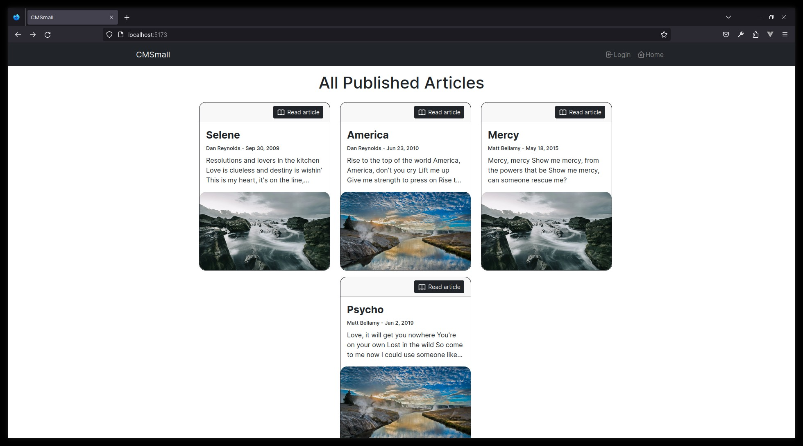
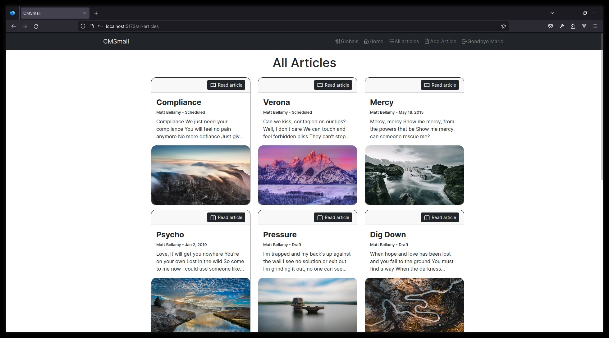

[](https://classroom.github.com/a/8AapHqUJ)

# Exam #1: "CMSmall"

## Student: sxxxxxx TEDESCO MATTEO

## React Client Application Routes

- Route `/`: index. It show all the published articles
- Route `/login`: login page
- Route `/articles/:id`: page of an article. It shows all the info of the article with id equals to :id
- Route `/articles/:id/edit`: page to edit an article. It shows all the info of the article with id equals to :id in a form and you can edit them
- Route `/articles/add`: page to add an article. It shows the form that enable the user to create a new article
- Route `/globals/edit`: page to edit the title showed in th navbar
- Route `/all-articles`: page to show all the articles in the db

## API Server

- **GET** `/api/articles` - Get all the published articles. All the block are ordered by order field

  - Request Body: **None**
  - Response Status: `200` OK, `500` if some errors occur
  - Response Body: an array of articles
    ```
    [
      {
        articleId: number - Article ID
        title: string - Article title
        publishedDate: string - The publication date in format yyyy-mm-dd
        createdAt: string - The creation date in format yyyy-mm-dd
        userId: number - The user that owns the article
        author: string - The author name
        contentBlocks: [
          {
            type: string - The type of the block
            data: string - The content of the block
          }
        ]
      }
    ]
    ```
<br />

- **GET** `/api/all-articles` - Get all the saved articles

  - Prerequisite: User is logged in
  - Request Body: **None**
  - Response Status: `200` OK, `500` if some errors occur, `401` Unauthorized
  - Response Body: an array of articles
    ```
    [
      {
        articleId: number - Article ID
        title: string - Article title
        publishedDate: string - The publication date in format yyyy-mm-dd
        createdAt: string - The creation date in format yyyy-mm-dd
        userId: number - The user that owns the article
        author: string - The author name
        contentBlocks: [
          {
            type: string - The type of the block
            data: string - The content of the block
          }
        ]
      }
    ]
    ```
<br />

- **GET** `/api/articles/:id` - Get a specific article

  - Prerequisite: User must be logged in if he want to get an article that is not published, otherwise is not necessary
  - Request Body: **None**
  - Response Status: `200` OK, `500` if some errors occur, `401` Unauthorized, `400` if the id is not a number, `404` if the article is not found
  - Response Body:
    ```
    {
      articleId: number - Article ID
      title: string - Article title
      publishedDate: string - The publication date in format yyyy-mm-dd
      createdAt: string - The creation date in format yyyy-mm-dd
      userId: number - The user that owns the article
      author: string - The author name
      contentBlocks: [
        {
          type: string - The type of the block
          data: string - The content of the block
        }
      ]
    }
    ```
<br />

- **POST** `/api/articles` - Create a new article

  - Prerequisite: User is logged in
  - Request Body:
    ```
    {
      title: string - Article title
      publishedDate: string - The publication date in format yyyy-mm-dd
      createdAt: string - The creation date in format yyyy-mm-dd
      userId: number - The user that owns the article
      author: string - The author name
      contentBlocks: [
        {
          type: string - The type of the block
          data: string - The content of the block
          order: number - The position of the block in the array
        }
      ]
    }
    ```
  - Response Status: `201` Created, `500` if some errors occur, `401` Unauthorized, `422` Unprocessable entity (Bad body format) if data does not respect the expected format
  - Response Body:
    ```
      {
        articleId: number - Article ID of the new article
      }
    ```
<br />

- **PATCH** `/api/articles/:id` - Edit an article

  - Prerequisite: User is logged in and he must be the owner of the article or an admin
  - Request Body:
    ```
    {
      articleId: number - Article ID
      title: string - Article title
      publishedDate: string - The publication date in format yyyy-mm-dd
      createdAt: string - The creation date in format yyyy-mm-dd
      userId: number - The user that owns the article
      author: string - The author name
      contentBlocks: [
        {
          type: string - The type of the block
          data: string - The content of the block
          order: number - The position of the block in the array
        }
      ]
    }
    ```
  - Response Status: `200` OK, `500` if some errors occur, `401` Unauthorized, `422` Unprocessable entity (Bad body format) if data does not respect the expected format, `400` if the id is not a number, `404` if the article is not found
  - Response Body:
    ```
    {
      articleId: number - Article ID of the edited article
    }
    ```
<br />

- **DELETE** `/api/articles/:id` - Delete an article

  - Prerequisite: User is logged in and he must be the owner of the article or an admin
  - Request Body: **None**
  - Response Status: `200` OK, `500` if some errors occur, `401` Unauthorized, `400` if the id is not a number, `404` if the article is not found
  - Response Body:
    ```
    {
      message: text
    }
    ```
<br />

- **GET** `/api/users` - Get all users info

  - Prerequisite: User is an admin
  - Request Body: **None**
  - Response Status: `200` OK, `500` if some errors occur, `401` Unauthorized
  - Response Body: an array of user
    ```
    [
      {
        userId: number - The user id
        name: string - The user name
        surname: string - The user surname
      }
    ]
    ```
<br />

- **GET** `/api/globals/:key` - Get the info based on the key param

  - Request Body: **None**
  - Response Status: `200` OK, `500` if some errors occur, `404` if the key is not found
  - Response Body:
    ```
    {
      value: text - The info requested
    }
    ```
<br />

- **PATCH** `/api/globals/:key` - Update the value of the :key

  - Prerequisite: User is an admin
  - Request Body:
    ```
    {
      value: string - The info that you want to update
    }
    ```
  - Response Status: `200` OK, `500` if some errors occur, `404` if the key is not found
  - Response Body:
    ```
    {
      message: text - A message to notify that everything has done
    }
    ```
<br />

- **POST** `/api/sessions` - Create a new session with the logged in user

  - Request Body:
    ```
    {
      username: 'user1@email.com',
      password: 'password1'
    }
    ```
  - Response Status: `200` OK, `401` Unauthorized
  - Response Body:
    ```
    {
      id: number - User ID
      username: string - User email
      name: string - User name
      surname: string - User surname
      role: string - The user role (admin or user)
    }
    ```

- **GET** `/api/sessions/current` - Get the info about the current user

  - Request Body: **None**
  - Response Status: `200` OK, `401` Unauthorized
  - Response Body:
    ```
    {
      id: number - User ID
      username: string - User email
      name: string - User name
      surname: string - User surname
      role: string - The user role (admin or user)
    }
    ```

- **DELETE** `/api/session/current` - Delete the current session and logout the user
  - Prerequisite: User is logged in
  - Request Body: **None**
  - Response Status: `200` OK, `401` Unauthorized
  - Response Body:
    ```
    {
      message: string
    }
    ```

## Database Tables

- Table `article` - contains all the courses available.  
   _**Columns**:_

  - `articleId`: integer - Article ID (PK)
  - `title`: text - The article title
  - `publishedDate`: text - The publication date
  - `createdAt`: text - The creation date
  - `userId`: integer - User ID (FK). It is used to find the iser that own the article
    <br />
    <br />

- Table `block` - contains the the blocks that are contained in an article  
   _**Columns**:_

  - `blockId`: integer - Block ID (PK)
  - `type`: text - the type of the block. It can be only `paragraph`, `header` and `image`
  - `value`: text - the content of the block
  - `order`: integer - the visualization position of the block
  - `articleId`: integer - Article ID (FK). It is used to find the article that owns the block
    <br />
    <br />

- Table `user` - contains the users

  _**Columns**:_

  - `userId`: integer - User ID (PK)
  - `email`: text - User email
  - `name`: text - User name
  - `surname`: text - User surname
  - `role`: text - User role (`admin` or `user`)
  - `salt`: text - Salt used to hash the password
  - `hash`: text - User password hashed
    <br />
    <br />

- Table `global` - contains global settings of the cms

  _**Columns**:_

  - `type`: text - type of the setting (PK)
  - `value`: text - value

## Main React Components

**All the components are responsive. All the validation of the data are made with zod that is a schema validator**

- `NavBar` (in `NavBar.jsx`): navigation bar of the application, shows the title and has different action if the user is logged in or not. 
  - **Not logged**: the login and the home button when the user
  - **Logged**: the user name, a link to the all articles page, a link to go to create new article page and logout button when.
- `LoginPage` (in `pages/login/loginPage.jsx`): login page with a form with a custom validation function to validate email and password fields.
- `EditArticle` (in `pages/article/edit/edit.jsx`): a page that fetch the article from the db and then pass it to the form that enable the user to edit the article. If the user is not logged in, the page redirect to the login page. 
- `AddArticle` (in `pages/article/add/add.jsx`): a page that load the form that enable the user to create a new article. If the user is not logged in, the page redirect to the login page.
- `ArticleForm` (in `ArticleForm.jsx`): this is the form component used to edit and create articles. It has a custom validation for each field. In the `Content Blocks` section you can add/remove blocks and you can also change the order in which they will be showed.
- `Index` (in `pages/index.jsx`): the index page. It shows all the published articles when it is called with the path `/`, while if it is called with the path `/all-articles` and the user is logged, it shows all the saved articles
- `GridContainer` (in `GridContainer.jsx`): a grid contaier that create rows and colums based on the width of the device

## Screenshot




## Users Credentials

- admin@email.com, password (Is the admin)
- user1@email.com, password1 (Normal user. He has 0 articles)
- user2@email.com, password2 (Normal user. He has 6 articles)
- user3@email.com, password3 (Normal user. He has 6 articles)
